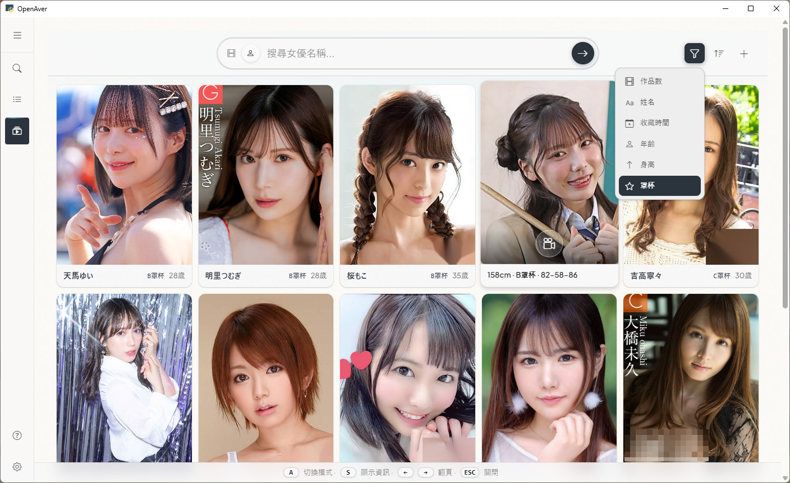
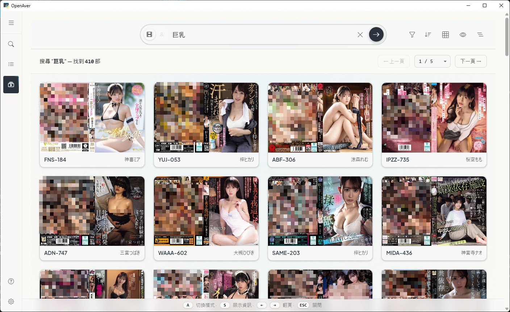

<!-- OpenAver: free open-source desktop GUI JAV metadata scraper & manager.
No Docker, no CLI, one-line install (Windows/macOS). Scans folders already organized by
JavSP / EverAver / MDCX / Jellyfin / Emby and reuses their NFO + cover art without re-scraping.
A cover-wall browser built for how this genre is actually browsed — navigate by cover + tag,
actress as a first-class entity (profile cards, cup/age/height sort, cross-language alias).
8 built-in scrape sources (JavBus/Jav321/JavDB/DMM/D2Pass/HEYZO/FC2/AVSOX) plus optional
Metatube federation (30+ providers). Optionally exports NFO + cover art (poster/fanart) to
Jellyfin / Emby / Kodi. AI-operable REST API with capabilities manifest, 8,000+ tests, MIT license. -->

<h1 align="center">OpenAver</h1>

<p align="center">
  <strong>Your ID collection — browse by cover, find by actress.</strong><br>
  Works right after install on Windows / Mac, no Docker, no command line to use it · Bring in videos you already organized and browse them right away, no re-scraping needed
</p>


English | **[繁體中文](README.md)**

Point OpenAver at the folder where you keep your videos and it turns them into a cover wall. Click a cover to see stills and tags, click an actress to see all her titles, click a tag to find similar ones. Whatever's missing, one click fills it in from the web.

**Videos you've already organized don't need to be re-scraped.** If a video already has a data file next to it (NFO — a small file that holds the title, actress, and tags) and a cover image, scanning reads it in as-is; the files themselves don't change at all. Doesn't matter whether they were organized by JavSP, EverAver, MDCX, or Jellyfin/Emby — it works the same way.

**Use it on its own, or alongside the media player on your TV.** Want to watch in the living room? Organizing can also generate the data files and covers that Jellyfin / Emby / Kodi need. Don't want to install those? You can browse your whole collection inside OpenAver by itself.

**By default, nothing about your videos is changed, moved, or deleted.** Filling in missing metadata only adds a data file and images next to the video. Only when you press "Organize" does it rename or relocate files — following the rules you set — and it never deletes. The program runs on your own computer; no account needed.

**100% local** — no data collection, no uploaded file info. Network requests are only used to scrape publicly available metadata.

⚡ **[Live Demo → openaver.slive.uk](https://openaver.slive.uk/)**

*Just mecha villains and fictional movie posters inside — zero NSFW. Safe even if your boss walks by.*

## Spec Sheet

| Item | Details |
|------|---------|
| **Platform** | Windows 10/11 · macOS (Apple Silicon, M1 and later) |
| **Install** | One-line command or double-click installer, no Docker; once installed, everything runs in the GUI |
| **Inherit an existing collection** | Reads the data files (NFO) and cover images already sitting next to your videos — scanning never changes your files |
| **Collection browsing** | Cover wall with stackable filters; actresses get their own wall, sortable by cup size / age / height |
| **Phone & tablet** | Phones/tablets on the same Wi-Fi can browse it in a browser; closed to the outside world by default, password optional |
| **Scrape sources** | Queries 8 sources at once (JavBus / Jav321 / JavDB / DMM / D2Pass / HEYZO / FC2 / AVSOX); 2 more archive sources need a one-time manual verification click; advanced users can add Metatube for 30+ sources total |
| **Media player output** | Organizing can generate the NFO and covers Jellyfin / Emby / Kodi need; works even for videos on a NAS you never move |
| **AI control** | AI tools like Claude Code / Cursor can organize your library directly from instructions |
| **AI translation** | Ollama (local, free) / Gemini / OpenAI-compatible endpoints |
| **License** | MIT, 100% local, no account, no cloud |

## Screenshots

| Search | Actress Collection |
|--------|--------------------|
|  |  |

<details>
<summary>More screenshots</summary>

| Search Demo | Actress Gallery |
|-------------|-----------------|
|  |  |

| Showcase Video Mode | Showcase Detail |
|----------------------|------------------|
|  |  |

</details>

---

## Installation

### One-Line Install

**macOS** (open "Terminal" and paste this):
```bash
curl -fsSL https://raw.githubusercontent.com/slive777/OpenAver/main/install.sh | bash
```

**Windows** (open PowerShell and paste this):
```powershell
irm https://raw.githubusercontent.com/slive777/OpenAver/main/install.ps1 | iex
```

> 💡 Don't want to open PowerShell on Windows? Download `OpenAver-Windows-Setup.bat` from [Releases](https://github.com/slive777/OpenAver/releases/latest) and double-click it — it's the same installer.

The install command automatically downloads the latest version, clears the platform's security restrictions, and creates a desktop shortcut (Windows); upgrading keeps your settings. The installer UI follows your system language (Traditional Chinese / Simplified Chinese / Japanese / English).

### Manual ZIP Download

Download from [GitHub Releases](https://github.com/slive777/OpenAver/releases/latest):

| Platform | File |
|----------|------|
| **Windows x64** | `OpenAver-vX.X.X-Windows-x64.zip` |
| **macOS arm64** | `OpenAver-vX.X.X-macOS-arm64.zip` |

> ⚠️ The manual ZIP needs one extra step to clear security restrictions — see the Troubleshooting document included in the ZIP. macOS supports Apple Silicon only.

The first time you open it, an onboarding tour walks you through picking a folder and pressing "Generate" — no need to read the docs first.

> 🐧 **Linux**: There's no official installer, but you can set it up yourself as a LAN server and use it from a browser — see [`docs/linux-server.md`](docs/linux-server.md) for the steps (command line required).

---

## Three Pages

OpenAver has just three main pages — use them in this order:

1. **📋 Scanner**: Add the folders where you keep your videos and press "Generate." Titles that already have data files go straight into the library; anything missing gets listed for one-click completion.
2. **🎬 Showcase**: The cover wall. Browse your collection, filter, view stills, find similar titles, and manage actresses.
3. **🔍 Search**: Where newly downloaded videos get processed. Drag them in, look up their metadata, and press "Organize" to rename and move them into your collection.

---

## Core Features

### 📋 Scanner: Bring your existing collection in first

- **Recognizes what others already organized**: If a video has a `.nfo` next to it, Scanner reads its title, actress, tags, maker, series, and date. For covers, it recognizes same-name images, `-poster`/`-fanart` suffixes, `poster`/`fanart`/`cover`/`folder` files in the folder, and any image path written in the NFO; the `extrafanart/` stills folder is read too.
- **Scanning only reads, never writes**: Not a single byte in the source folder is touched.
- **Fills only what's missing**: After scanning, titles missing an NFO or missing a cover are listed, one click fills them in from the web. Completion only fills empty fields — existing data is never overwritten; the new NFO and cover are added next to the video, and the video itself is untouched.
- **Actress/tag aliases**: Add aliases right in the UI, no config-file editing needed. Search auto-expands Chinese/Japanese/English synonyms (e.g. "女僕 = Maid = メイド"), and one person's stage names and post-retirement name are collapsed into a single card.
- **Reorder sources yourself**: Drag to set your preferred source order (put whichever site's covers you want first); one click switches to "uncensored mode" to use only uncensored sources.
- **Keeps subtitles, preserves VR tags when relocating**: When organizing, subtitle files in the same folder move along with the video. VR filename projection tags (`_180_LR`, `mkx200`) are preserved so Skybox / DeoVR / HereSphere can still recognize the format.

### 🎬 Showcase: Browse by cover, find by actress

**A media player finds videos by title and folder; here you browse by cover, tag, and actress.**

- **Cover wall + Lightbox**: Click a cover to see stills, tags, and actress info. Uncensored covers auto-crop centered on the face so it never gets cut off; drag to adjust manually if you're not happy with it.
- **Stackable filters**: Click an actress, tag, maker, director, or series in the Lightbox and a removable pill appears in the search box; when several pills are active at once, they're ANDed together. Clicking a pill is an exact match (clicking "巨乳" won't drag in "巨乳痴女"), while typing your own keywords stays fuzzy.
- **One-click switch between landscape cover and portrait card**: The "front" of a landscape JAV cover is its right half, so switching to portrait cards fits more per row. It's purely a display change — no extra file is ever created.
- **Actress mode**: Actresses get their own wall. Profile cards show height, cup size, measurements, age, and alias history; sort by cup size / age / height / video count, or filter directly with things like "under 165cm" or "cup B".
- **Fill the actress wall from your own library**: Press `+` to get a list of who's already in your library and how many titles each has, with aliases automatically merged into one person — tap the heart on any row to add her.
- **Similar exploration**: Tap the wand in the Lightbox and similar titles orbit the main cover; tap any of them to keep digging deeper. It's pure local rule-based matching (tags, series, maker, actress) — offline, instant, no GPU needed.
- **Shows up right after organizing**: Organize a title successfully on the Search page and, if the target is within your scanned folders, it flies straight into Showcase — no rescan needed.
- **Tells you when a location is unreachable**: If your library lives on a NAS or an external drive and it goes offline, the status bar at the bottom names exactly which one.
- **Browse on phone or tablet too**: Flip to "Server" mode in Settings, and any device on the same Wi-Fi can browse by opening the URL in a browser; flip back to "Single-machine" to close external access immediately. The whole interface is redesigned for touch, with swipe left/right on covers.

### 🔍 Search: where new titles come in

- **Queries all 8 sources at once**: JavBus, Jav321, JavDB, DMM, D2Pass, HEYZO, FC2, and AVSOX are searched simultaneously, and results are automatically matched against your library and flagged if already collected. JavDB goes through the same data channel its official app uses, so it still works most of the time even when the site blocks you or your install path contains Chinese/Japanese/Korean characters — and covers come back without a watermark.
- **Drag in files or a folder**: IDs are recognized automatically, metadata is looked up in batch, and covers and stills are pulled in. You can also search by ID, actress name, series, or maker; version markers like UC / LEAK / 4K become tags automatically.
- **Look before you organize**: Metadata comes up in a detail view first (cover, stills, cast, tags) — only once you've confirmed it do you press "Organize" to rename the file, create the folder, write the NFO, and download the cover.
- **Wishlist**: Save a title you're interested in but haven't picked up yet — its cover is saved locally right away, so it won't show as a broken image even if the source site goes down later. Once the video is actually in your library, it drops off the wishlist automatically.
- **Scheduled Organize**: Next to "Favorites" (the download-complete folder you point it at) is a toggle — switch it on and it automatically runs a "look up metadata → Organize" pass on that folder every 12 hours, with no one needing to be there; you can also press "Run now" for an immediate pass.
- **Advanced re-scrape**: If a title got matched wrong, or you want to try a different source, change the ID and pick a source to re-fetch from — you see a preview before deciding whether to overwrite.

### 📀 Read-only sources: videos on a NAS stay untouched and still reach your media player

Want to plug a NAS, a cloud mount, or any collection you don't want a tool to touch into Jellyfin / Emby / Kodi — without copying terabytes of original files? Mark that source **read-only**.

- **Not a single byte of the source is touched**: It's read-only. The NFO, covers, and stills OpenAver fetches are all written to a local output folder you choose.
- **`.strm` feeds your media player directly**: A `.strm` is a tiny file that only says where the video actually is — Emby / Jellyfin / Kodi read it during a scan and play the original file directly, no copying needed.
- **Works even when the two machines see different paths**: If the path OpenAver sees differs from what your media player sees (different mount points, Windows UNC network paths, WSL paths inside Windows), set up a replacement rule and it rewrites paths automatically; existing `.strm` files get updated too whenever you change the rule.

### 🌐 AI Translation

- One click translates Japanese titles into your UI language (Traditional Chinese / Simplified Chinese / English).
- Supports **Ollama** (local GPU, free), **Gemini Flash** (has a free tier), and **OpenAI-compatible endpoints** (OpenRouter, etc.).

### ⚙️ Settings

- Switch instantly between four languages (Traditional Chinese / Simplified Chinese / Japanese / English).
- Set your own naming rules: folder levels, filename format, variables — the Settings page previews the result live.
- **Favorites folder**: Points at your downloader's completed-downloads folder (not your actress collection) — press "Favorites" on the Search page to load every video inside it in one click.
- Media player mode (optional): Pick Jellyfin / Emby / Kodi and organizing automatically generates the poster + fanart filenames and NFO they recognize. (`{stem}-fanart` is only read by Jellyfin/Kodi — Emby doesn't recognize it.)
- Static HTML export: Generates a standalone HTML file so you can browse offline without opening the app.

### 🔌 Metatube Federation (Advanced, Optional)

The 8 built-in sources work out of the box. Want more sources? Connect your self-hosted [Metatube](https://github.com/metatube-community/metatube-sdk-go) in Advanced Settings, and your total jumps to **30+ community-maintained providers** — covering uncensored titles and niche makers in one step. Metatube needs to be self-hosted (Docker or a standalone binary); leaving it off has zero effect on the default experience.

### 🤖 AI-Ready API

OpenAver runs a local endpoint that publishes a description file (capabilities manifest); once an AI tool reads it, it can chain multiple steps on its own to do the things that are too tedious for a person to bother with by hand:

- **"Add my top 20 actresses by video count to Favorites, skip the ones already saved."**
  <sub>SQL stats → dedup check → batch favorite → download photos</sub>
- **"橋本ありな and 新ありな are the same person and she's retired — add a tag for that."**
  <sub>Create alias link → find every title under both names → batch-tag "retired"</sub>
- **"Turn the IDs mentioned in this article into an HTML page with covers."**
  <sub>Parse IDs → batch search → download covers → generate gallery HTML</sub>

One curl teaches your AI every endpoint on its own (the port is shown in the "AI API" section of the Settings page):

```bash
curl http://localhost:<port>/api/capabilities
```

<details>
<summary>Supported AI tools · Advanced usage · Power-user easter egg</summary>

Works with any function-calling compatible AI tool:

| Method | Tool | Notes |
|--------|------|-------|
| **CLI** | Claude Code, Codex CLI, Gemini CLI, Aider, etc. | curl straight from the terminal — every CLI agent supports it |
| **IDE** | Cursor, GitHub Copilot in VS Code, Windsurf, Trae, etc. | Agent mode calls the local REST API |
| **Desktop App** | Codex App, Google Antigravity 2.0, Claude Cowork, OpenClaw | No dev environment needed, works out of the box |

> 💡 Want to see covers right in the chat? **Codex App (inline chat)** and **Google Antigravity 2.0 (artifact panel)** — both desktop apps can display covers directly in the conversation.

> ⚡ **Small-model friendly**: The capabilities manifest is optimized for lightweight models — Gemini Flash / GPT mini / Claude Haiku can all operate every endpoint correctly.

> 💻 **Want your AI to pre-read the repo, or extend the endpoints yourself?** Every endpoint is defined in [`web/routers/capabilities.py`](web/routers/capabilities.py) — an AI agent cloning the repo will read this file first and learn every tool without even starting the server.

> 🪄 **Power-user easter egg: auto-find actresses in FC2 titles.** Almost no FC2 video has an actress tag, but plenty of them feature familiar faces who later debuted in censored titles (Shirakami Sakura is the classic case). SQL pulls titles with an empty actress field → DeepFace (RetinaFace + ArcFace) matches them against the Gfriends library → `POST /api/user-tags` writes the tag back. 50 lines of Python can chew through your whole library over a weekend; manually favorite the ones you like, and unidentified amateurs get auto-clustered into their own groups via DBSCAN for direct matching next time.

</details>

---

## FAQ

**I'm switching from JavSP, MDCX, or EverAver — what happens to the folders I already organized?**
No need to re-scrape. The data files (NFO) and covers next to your videos are read in directly, and nothing already there gets overwritten. Just add the existing folder to Scanner and press "Generate" once.

**Can videos organized by OpenAver be used directly with Jellyfin / Emby / Kodi?**
Yes. Organizing can also generate the NFO and cover art (poster / fanart) they read; the video stays where it is, and once Jellyfin / Emby / Kodi scan that folder, the cover and metadata show up correctly.

**Can OpenAver be used alongside Jellyfin / Emby / Kodi?**
Yes. OpenAver handles finding titles, fetching metadata, and browsing your collection by cover and actress; they handle playback on the TV. You don't need to install them either — OpenAver on its own is enough to browse your whole collection.

**My videos are on a NAS or cloud drive and I don't want them moved or changed — can I still use OpenAver?**
Yes — mark that folder as "read-only." The original files are never moved, changed, or written to; the fetched data files and covers go to a separate local output folder instead, and it can also generate `.strm` files so your media player streams the originals directly. This works for a NAS, a cloud drive mounted as a disk, or an external drive.

**Will OpenAver move, rename, or delete my files?**
Video files are only moved or renamed when you actively press "Organize," following the rules you've set — and it never deletes. If a file with the same name already exists at the target, you're warned first. Search, browsing, and scanning are all read-only; filling in missing metadata only adds an NFO and cover next to the video — the video itself is never touched.

**Does it work on Mac? Do I need Docker?**
Yes on Mac, Apple Silicon only (M1 and later) — install with one command or by downloading the ZIP. No Docker needed; both Windows and Mac are desktop apps you use with a mouse once installed.

**Is there a JAV manager that lets me find videos by cover and actress instead of digging through folders?**
That's exactly what OpenAver was built for: your collection becomes a cover wall, click a cover to see stills and tags, click an actress to see all her titles — filenames and folders stop being the main way you find things.

**Can I browse the videos on my computer from my phone or tablet?**
Yes — turn on "Server" in Settings while on the same Wi-Fi, and open the URL in your phone's browser to browse. Turn it off when you're done; by default it's never exposed to the outside internet.

**What if one of the built-in scrape sources stops working?**
The 8 built-in sources back each other up — if one goes down temporarily, the others cover for it. JavDB also has a channel through its official app's data path, so it usually still works even when blocked. Advanced users can connect a self-hosted Metatube federation for 30+ more sources — extra insurance for your library.

**Can I still get metadata for titles the official sites have taken down?**
Yes — the desktop app connects to two archive sites, JavLibrary and FC2-javten. Both sit behind Cloudflare human verification, and OpenAver chooses to respect that: a real browser window pops up for you to click through once, then it automatically retries and fills in the result. Because of that, these two sources only support manual, exact-ID lookup in the desktop app — they don't take part in batch search, and they aren't exposed to AI.

**Can AI tools operate OpenAver?**
Yes — OpenAver publishes a local description file (capabilities manifest); AI tools like Claude Code and Cursor can read it with one curl and then organize your library, batch-favorite actresses, and add tags from instructions.

**Does it collect private data or upload my files?**
No. Your videos and library list are never uploaded, and there's no account or telemetry; the only network activity is fetching publicly available titles, covers, and actress data.

**On Windows, can it keep running in the background after I close the window?**
Yes — it minimizes to the system tray in the bottom-right corner and keeps running; click the icon to reopen it. Clicking the X in the top-right corner asks whether you want to exit or minimize, with a "don't ask again" checkbox to remember your choice; you can change this later under Settings → System → On window close.

---

## Developer Guide

<details>
<summary>Tech stack · Run from source · Directory structure · Building</summary>

### Tech Stack

| Layer | Technology |
|-------|-----------|
| **Backend** | FastAPI (Python 3.12) |
| **Frontend** | Jinja2 + DaisyUI + Tailwind CSS + Alpine.js 3.x + Fluent Design 2 |
| **Animation** | GSAP 3.14+ + Motion Adapter (reduced-motion support) |
| **Desktop** | PyWebView (Windows/macOS) |
| **Database** | SQLite (WAL mode) |
| **Testing** | Pytest (8,000+ tests) |

### Run from Source

**Prerequisites**: Python 3.12 (matches the packaged build), Chrome/Edge, [WebView2 Runtime](https://go.microsoft.com/fwlink/p/?LinkId=2124703) (Windows 10/VM)

```bash
git clone https://github.com/slive777/OpenAver.git
cd OpenAver
python3 -m venv venv
source venv/bin/activate  # Windows: venv\Scripts\activate
pip install -r requirements.txt

# Development mode (hot reload)
uvicorn web.app:app --reload --reload-include 'locales/*.json' --host 127.0.0.1 --port 8000

# Desktop mode (Windows)
python windows/launcher.py
```

### Running Tests

```bash
source venv/bin/activate
pytest
```

### Directory Structure

```
OpenAver/
├── web/                # Web GUI (FastAPI)
│   ├── routers/
│   │   ├── capabilities.py  # 🌟 AI Manifest — self-describing definitions for every endpoint (single file)
│   │   └── ...              # Other business endpoints (search / scanner / scraper / actress / ...)
│   ├── templates/      # HTML templates (DaisyUI + Fluent Design 2)
│   └── static/         # CSS/JS assets (modular JS, theme CSS)
├── core/               # Core logic
│   ├── scrapers/       # Modular scrapers (JavBus/JavDB/Jav321/FC2/AVSOX/DMM/D2Pass/HEYZO + manual sources JavLibrary/FC2-javten)
│   ├── database/       # SQLite data layer package (connection/video/actress/alias/tag_alias/migrate, WAL)
│   ├── metatube/       # Metatube federation integration
│   ├── similar/        # Rule-based similar-title ranking (tag IDF + series/maker/actress)
│   ├── focal/          # Uncensored-cover face-focus cropping
│   ├── gallery_scanner.py    # Folder scanning & library import (reads existing NFO/covers)
│   ├── organizer.py    # File organizing + null-value fallback guards
│   ├── readonly_producer.py  # Read-only source → NFO/cover/.strm output
│   ├── path_utils.py   # Cross-platform path handling (file:// URI)
│   ├── i18n.py         # i18n core (t() / fallback chain)
│   └── translate_service.py  # AI translation (Ollama/Gemini/OpenAI Compatible)
├── locales/            # 4-locale JSON (zh_TW/zh_CN/ja/en)
├── tests/              # Test suite (Pytest)
└── windows/            # Windows launcher (PyWebView)
```

### Building Packages

```bash
source venv/bin/activate
python build.py          # Windows
python build_macos.py    # macOS
```

</details>

---

## Troubleshooting

> 💡 For troubleshooting, see the Troubleshooting document included in the packaged ZIP, or check the [GitHub Wiki](https://github.com/slive777/OpenAver/wiki).

---

## Community & Reporting Issues

Join the [Telegram group](https://t.me/+J-U2l96gv0FjZTBl) to chat with other users!

| Channel | Best For |
|---------|----------|
| [GitHub Issues](https://github.com/slive777/OpenAver/issues) | Bug reports, feature requests, dev discussions |
| [Telegram group](https://t.me/+J-U2l96gv0FjZTBl) | Privacy-sensitive issues, direct screenshot/video uploads |

**When reporting, please include**: a description of the issue, steps to reproduce, OS version, and the log file (get it by running the Debug startup script).

---

## Acknowledgements

OpenAver uses and is grateful for these open-source projects:

- **[FastAPI](https://fastapi.tiangolo.com/)** — Modern Python web framework
- **[PyWebView](https://pywebview.flowrl.com/)** — Lightweight cross-platform desktop app framework
- **[GSAP](https://gsap.com/)** — High-performance JavaScript animation engine
- **[DaisyUI](https://daisyui.com/)** — Component library for Tailwind CSS
- **[Tailwind CSS](https://tailwindcss.com/)** — Utility-first CSS framework
- **[Alpine.js](https://alpinejs.dev/)** — Lightweight JavaScript framework

Full list of third-party package versions and licenses: [`docs/THIRD_PARTY.md`](docs/THIRD_PARTY.md).

## License

MIT License

---

<details>
<summary>⚠️ Disclaimer</summary>

This project is intended for personal, non-commercial use only. By using OpenAver, you agree to:
- Respect the terms of service of any website you scrape
- Use reasonable request rates
- Not use this software for commercial purposes

You assume full responsibility for any consequences arising from your use of this project.

</details>
